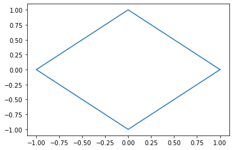

```python
#P2.4.6
def fnc(n):
    if(n == 1 or n == 2):
        return n
    else:
        return n * fnc(n - 2)
n = int(input())
print(fnc(n))
# both work for even and odd
```

    6
    48


```python
#Q2.5.1
a = [2,4,10,6,8,4]
mx = max(a)
mn = min(a);
for i, val in enumerate(a):
    x = val - mn
    y = mx - mn
    a[i] = x / y
print(a)

```

    [0.0, 0.25, 1.0, 0.5, 0.75, 0.25]


```python
#Q2.5.2
import math as m
sum = 1.e-14
a = 1.0
b = m.sqrt(2)
while abs(a - b) > sum:
    a = (a + b) / 2
    b = m.sqrt(a * b)
print(1 / a)
```

    0.7853981633974505


```python
#P2.5.3
n = [4, 7, 9, 9, 2, 7, 3, 9, 8, 7, 4, 3, 6, 2, 7, 2]
#n[::-1]
n.reverse()
sum = 0
for i in range(16):
    if(i % 2 != 0):
        ve = int(n[i]) * 2
        if(ve > 9):
            x = ve % 10
            ve = ve // 10
            y = ve % 10
            ve = x + y
        sum += ve
if(sum % 10 == 0):
    print("Valid")
else:
    print("Invalid")
```

    Valid


```python
#P2.5.7
def fnc(n):
    if(n == 1):
        return
    elif(n % 2 == 0):
        print(" ", n // 2)
        fnc( n // 2)
    else:
        print(" ", (n // 2) + 1)
        fnc((n // 2) + 1)
print(fnc(int(input())))
```

    27
      14
      7
      4
      2
      1
    None


```python
#P2.5.8
import math
n = [True for i in range(10004)]
for i in range(4, 10004, 2):
    n[i] = False
n[1] = False
for i in range(3, int(math.sqrt(10004) + 1), 2):
    if(n[i] == True):
        for j in range(i * i, 10004, i):
            n[j] = False
for i in range(2, 100):
    if(n[i] == True):
        print(i)
print("....\n....\n....")
for i in range(9500, 10004):
    if(n[i] == True):
        print(i)
```

    2
    3
    5
    7
    11
    13
    17
    19
    23
    29
    31
    37
    41
    43
    47
    53
    59
    61
    67
    71
    73
    79
    83
    89
    97
    ....
    ....
    ....
    9511
    9521
    9533
    9539
    9547
    9551
    9587
    9601
    9613
    9619
    9623
    9629
    9631
    9643
    9649
    9661
    9677
    9679
    9689
    9697
    9719
    9721
    9733
    9739
    9743
    9749
    9767
    9769
    9781
    9787
    9791
    9803
    9811
    9817
    9829
    9833
    9839
    9851
    9857
    9859
    9871
    9883
    9887
    9901
    9907
    9923
    9929
    9931
    9941
    9949
    9967
    9973


```python
#Class task
import pylab
f = open("input.txt", "r")
x, y = [], []
for i in f.readlines():
    ve = i.split(",")
    x.append(int(ve[0]))
    y.append(int(ve[1]))
pylab.plot(x, y)
pylab.show()
```





```python
#P2.6.1
import math as m
f = open("Gymnosperm_database.txt", "r")
name, location, d, h = [], [], [], []
mxd = -1.0
mxh = -1.0
for i in f.readlines():
    ve = i.split("\t")
    name.append(str(ve[0]))
    location.append(str(ve[1]))
    d.append(float(ve[2]))
    h.append(float(ve[3]))
for i in range(len(h)):
    mxd = max(mxd, d[i])
    mxh = max(mxh, h[i])
print(mxd, " ", mxh)
```

    5.18   115.61
