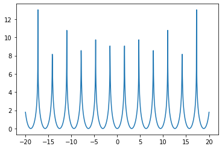
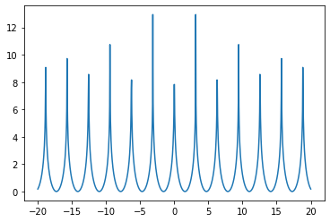
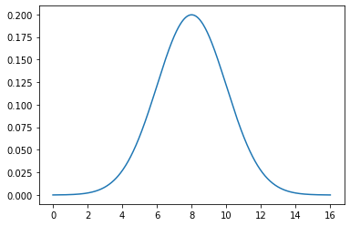
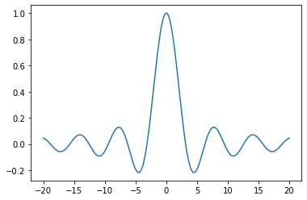
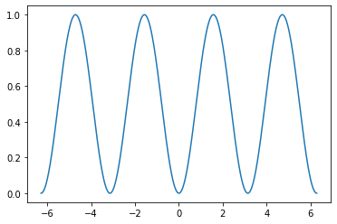
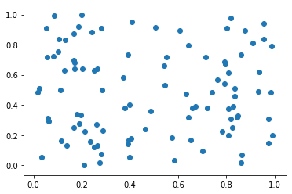
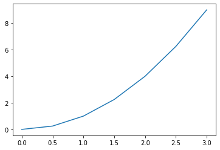

```python
#P2.7.1
def fnc(s, pos):
    a = ord(pos[0]) - ord('A') + 1
    b = ord(pos[1]) - ord('0')
    a = 15 - a
    b = 15 - b
    
    if(len(s) <= a):
        return "YES"
    elif(len(s) <= b):
        return "YES"
    else:
        return "NO"
s = input()
pos = input()
print(fnc(s, pos))
```

    samiul
    D3
    YES


```python
#P2.7.2
def fnc(n):
    mul = 1
    for i in range(n):
        mul = mul * (i + 1)
    temp = mul
    sm = 0
    while(temp > 0):
        sm = sm + int(temp % 10)
        temp = temp / 10
    if(mul % sm != 0):
        #print(mul, sm)
        return True
    else:
        return False
    
i = 1
while(fnc(i) == False):
    i = i + 1
print(i)
```

    23


```python
#P2.7.3
import math as m
def dot_fnc(a, b):
    sum = 0
    for i in range(3):
        sum = sum + (a[i] * b[i])
    return sum
def cross_fnc(a, b):
    sum = 0
    sum = sum + ((b[2] * a[1]) - (b[1] * a[2])) ** 2
    sum = sum + (-((b[2] * a[0]) - (b[0] * a[2]))) ** 2
    sum = sum + ((a[0] * b[1]) - (a[1] * b[0])) ** 2
    return m.sqrt(sum)
    
a, b = [100, 200, -6], [4, -6, 5]
print("Dot product: ", dot_fnc(a, b))
a, b = [3, 1, -2], [1, -3, 4]
print("Cross product: ", cross_fnc(a, b))
```

    Dot product:  -830
    Cross product:  17.320508075688775


```python
#P2.7.4
import math
def pyramid_AV(n, s, h):
    pi = math.acos(-1.0)
    a = .5 * s * (1 / math.tan(math.radians(pi / n)))
    A = .5 * n * s * a
    l = math.sqrt(h ** 2 + a ** 2)
    V = (1 / 3) * A * h
    S = A + .5 * n * s * l
    return V, S
a, b = pyramid_AV(18, 20, 3)
print("Value of V: ", a, "\nValue of S: ", b)
```

    Value of V:  590903.3152964646 
    Value of S:  1181806.877333751


```python
#P2.7.5
import math
def range(ang, v):
    v = v ** 2
    a = math.sin(math.radians(2 * ang))
    return (v * a) / 9.81
def hight(ang, v):
    v = v ** 2
    a = math.sin(math.radians(ang)) ** 2
    return (v * a) / (2 * 9.81)
print("Range: ", range(30, 10))
print("Height: ", hight(30, 10))
```

    Range:  8.827985767425469
    Height:  1.2742099898063197


```python
#P2.7.6
import math
def fnc(n):
    if(n == 1 or n == 2):
        return n
    else:
        return n * fnc(n - 2)
def sinm_cosn(m, n):
    pii = math.acos(-1.0)
    a = fnc(m - 1)
    b = fnc(n - 1)
    c = fnc(m + n)
    ve = (a * b) / c
    if(m % 2 == 0 and n % 2 == 0):
        return ve * (pii / 2)
    else:
        return ve
    
print(sinm_cosn(2, 4))
```

    0.09817477042468103


```python
#E2.7.7
def palindrome(s, i, j):
    if(i > j):
        return "palindrome"
    elif(s[i] == s[j]):
        return palindrome(s, i + 1, j - 1)
    else:
        return "not palindrome"
s = "MADAM"
print(palindrome(s, 0, len(s) - 1))
```

    palindrome


```python
#P2.7.8
def fnc(a, b):
    if(b == 0):
        return 1
    elif(b % 2 == 0):
        re = fnc(a, b / 2)
        return re * re
    else:
        return a * fnc(a, b - 1)
def fnc1(n):
    co = 0
    while(n > 0):
        co = co + 1
        n = n // 10
    return co

n = int(input("Enter the value for n: "))
x = int(input("Enter the value for x: "))
a, b = x, x
ans = 0
for i in range(n - 1):
    ans = fnc(a, b)
    b = ans
print("Number of digits in ", n, x, ": ", fnc1(ans))
```

    Enter the value for n: 3
    Enter the value for x: 5
    Number of digits in  3 5 :  2185


```python
#P3.1.1__1
import math, pylab, numpy
n = 1000
mn, mx = -20, 20
x = pylab.linspace(mn, mx, n)
temp = pylab.cos(x) ** 2
y = numpy.log(1 / temp)
pylab.plot(x, y)
pylab.show()
```





```python
#P3.1.1__2
import math, pylab, numpy
n = 1000
mn, mx = -20, 20
x = pylab.linspace(mn, mx, n)
temp = pylab.sin(x) ** 2
y = numpy.log(1 / temp)
pylab.plot(x, y)
pylab.show()
```





```python
#P3.1.3
import numpy as np, math as m
import pylab as plt
import scipy.stats
n = 1000
mn, mx, meam, std = 0.0, 16.0, 8.0, 2.0
x = np.linspace(mn, mx, n)
y = scipy.stats.norm.pdf(x,mean,std)
plt.plot(x, y)
plt.show()
```





```python
import math, pylab
n = 1000
mn, mx = -20., 20.
x = pylab.linspace(mn, mx, n)
y = pylab.sin(x) / x
pylab.plot(x, y)
pylab.show()
```





```python
import math, pylab
n = 1000
mn, mx = -2.0 * math.pi, 2.0 * math.pi
x = pylab.linspace(mn, mx, n)
y = pylab.sin(x) ** 2
pylab.plot(x, y)
pylab.show()
```


```python
import math, pylab
xmin, xmax = -2.0 * math.pi, 2 * math.pi
n = 1000
x = [0.] * n
y = [0.] * n
dx = (xmax - xmin) / (n - 1)
for i in range(n):
    xpt = xmin + i * dx
    x[i] = xpt
    y[i] = math.sin(xpt) ** 2
pylab.plot(x, y)
pylab.show()
```





```python
import pylab
import numpy as np
ax, ay = [], []
for i in range(100):
    ax.append(np.random.random())
    ay.append(np.random.random())
pylab.scatter(ax, ay)
pylab.show()
```





```python
import pylab
ax = [0., 0.5, 1.0, 1.5, 2.0, 2.5, 3.0]
ay = [0.0, 0.25, 1.0, 2.25, 4.0, 6.25, 9.0]
pylab.plot(ax, ay)
pylab.show()
```



